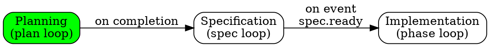

# Phase: Pipeline Monitoring

**ID:** 004-pipeline-monitoring
**Spec:** 019-pipeline-config
**Dependencies:** [001-pipeline-model, 002-pipeline-execution-engine, 003-advanced-triggers]
**Status:** Ready

## Summary

Implement comprehensive monitoring capabilities for pipeline execution including visualization, execution tracking, performance metrics, and debugging tools. This phase provides observability into pipeline operations.

## Acceptance Criteria

1. **Pipeline Visualization**
   - [ ] Generate pipeline DAG representation
   - [ ] Show current execution state
   - [ ] Display stage dependencies
   - [ ] Indicate trigger conditions
   - [ ] Support real-time updates

2. **Execution Tracking**
   - [ ] Track pipeline runs with unique IDs
   - [ ] Record stage start/end times
   - [ ] Log stage inputs/outputs
   - [ ] Track resource usage
   - [ ] Store execution history

3. **Performance Metrics**
   - [ ] Measure stage execution times
   - [ ] Track queue wait times
   - [ ] Monitor resource utilization
   - [ ] Calculate success/failure rates
   - [ ] Generate performance reports

4. **Debug Tools**
   - [ ] Implement trace logging
   - [ ] Provide execution replay
   - [ ] Support breakpoint setting
   - [ ] Enable step-through execution
   - [ ] Export debug dumps

5. **Monitoring Integration**
   - [ ] Expose Prometheus metrics
   - [ ] Support OpenTelemetry tracing
   - [ ] Emit structured logs
   - [ ] Provide health endpoints
   - [ ] Generate alerts

## Implementation Details

### Files to Create

1. **`src/pipeline/monitor.rs`**
   - Core monitoring types
   - Metric collection
   - Event emission
   - Integration points

2. **`src/pipeline/visualization.rs`**
   - DAG generation
   - State representation
   - Export formats (DOT, JSON)
   - Real-time updates

3. **`src/pipeline/tracking.rs`**
   - Execution tracking
   - History storage
   - Query interface
   - Retention policies

4. **`src/pipeline/metrics.rs`**
   - Metric definitions
   - Collection logic
   - Aggregation rules
   - Export endpoints

5. **`src/pipeline/debug.rs`**
   - Debug mode implementation
   - Trace collection
   - Replay functionality
   - Breakpoint handling

### Files to Modify

1. **`src/pipeline/engine.rs`**
   - Add monitoring hooks
   - Emit execution events
   - Collect metrics
   - Support debug mode

2. **`src/pipeline/state.rs`**
   - Add tracking information
   - Include timestamps
   - Store debug data

3. **`src/pipeline/mod.rs`**
   - Export monitoring modules

### Test Cases

1. **Visualization Tests** (`tests/pipeline_visualization_test.rs`)
   - Test DAG generation
   - Test state representation
   - Test export formats
   - Test update mechanisms

2. **Tracking Tests** (`tests/pipeline_tracking_test.rs`)
   - Test execution recording
   - Test history queries
   - Test retention
   - Test data integrity

3. **Metrics Tests** (`tests/pipeline_metrics_test.rs`)
   - Test metric collection
   - Test aggregation
   - Test export formats
   - Test performance impact

4. **Debug Tests** (`tests/pipeline_debug_test.rs`)
   - Test trace logging
   - Test replay functionality
   - Test breakpoints
   - Test debug dumps

## Validation Script

```bash
# Run monitoring tests
cargo test pipeline_monitor
cargo test pipeline_visualization
cargo test pipeline_tracking
cargo test pipeline_metrics
cargo test pipeline_debug

# Test metrics endpoint
cargo run --example pipeline_metrics_server &
curl http://localhost:9090/metrics | grep pipeline_

# Test visualization
cargo run --example visualize_pipeline > pipeline.dot
dot -Tpng pipeline.dot -o pipeline.png

# Ensure no performance regression
cargo bench pipeline_with_monitoring
```

## Example Usage

```rust
use taskdaemon::pipeline::{PipelineMonitor, VisualizationFormat};

// Create monitor
let monitor = PipelineMonitor::new();

// Track execution
let run_id = monitor.start_run(&pipeline_def);
monitor.stage_started(run_id, "planning");
monitor.stage_completed(run_id, "planning", &output);

// Get visualization
let dag = monitor.visualize(&pipeline_def, VisualizationFormat::Dot);
println!("{}", dag);

// Query metrics
let metrics = monitor.get_metrics();
println!("Average execution time: {:?}", metrics.avg_execution_time);
println!("Success rate: {:.2}%", metrics.success_rate * 100.0);

// Debug mode
let mut debug_engine = engine.with_debug(true);
debug_engine.set_breakpoint("specification");
debug_engine.execute(input).await?;
```

## Metrics Schema

```yaml
# Pipeline-level metrics
pipeline_executions_total{pipeline="name",status="success|failure"}
pipeline_execution_duration_seconds{pipeline="name",quantile="0.5|0.9|0.99"}
pipeline_active_executions{pipeline="name"}

# Stage-level metrics  
pipeline_stage_executions_total{pipeline="name",stage="name",status="success|failure"}
pipeline_stage_duration_seconds{pipeline="name",stage="name",quantile="0.5|0.9|0.99"}
pipeline_stage_queue_time_seconds{pipeline="name",stage="name"}

# Trigger metrics
pipeline_trigger_evaluations_total{pipeline="name",stage="name",trigger_type="type"}
pipeline_trigger_wait_time_seconds{pipeline="name",stage="name"}

# Resource metrics
pipeline_memory_usage_bytes{pipeline="name",stage="name"}
pipeline_cpu_usage_percent{pipeline="name",stage="name"}
```

## Visualization Format

The DOT format output for pipeline visualization:

